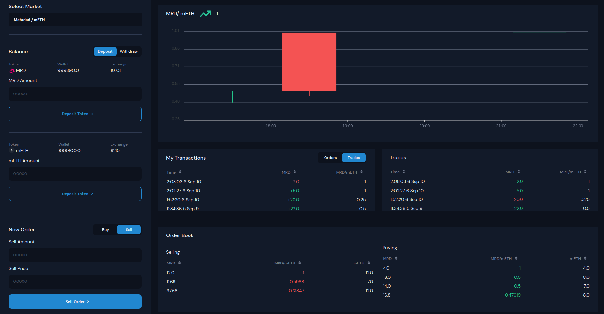

# Decentralized Exchange (EVM Compatible)

### This project demonstrates a basic DEX that user can deposit ERC-20 token and exchange them for another ERC-20 toke

## Project Description :
This is a decentralized exchange that runs on ethereum chain . you can deposit/withdraw ERC20 tokens and trade them for another 
ERC20 tokens using price chart to analyze the price of an asset and also see all the trades and transactions    
The project have 3 main section :

-[***Navbar***](src/assets/navbar.png)
  - Indicates the account and it balance and also the network 
 
-[***Sidebar***](src/assets/sidebar.png)
  - It shows the market to choose from 
  - Deposit and Withdraws tokens 
  - Making buy and sell orders

-[***main panel***](src/assets/mainpanel.png)   
  - Price chart 
  - It shows all the orders and user specific orders 
  - trades and all transactions  
  
   

## Manual instructions :
I used hardhat for development and also react for the front end so first of all you have install node fully installed 
  
- you can use the link below to install node( node version manager) and hardhat : 
 -[NVM GitHUb](https://github.com/nvm-sh/nvm)
 -[hardhat](https://hardhat.org/hardhat-runner/docs/getting-started#overview)

- you have to run the hardhat node : 
 `npx hardhat node` 
- deploy your contract :
 `npx hardhat run --network localhost scripts/1_deploy.js`
- then run the rect app with npm 
 `npm run start` 

## Technical Overview :
The project consist of 4 parts: 
- **Contracts**
> ERC20 standard tokens 
- **Testing**
>I used hardhat and chai matchers to test my contracts
- **Scripts**
>using the script for deployment and seeding the exchange to automate the process
- **React/redux**
> and lastly but not least i used react for the front end development
